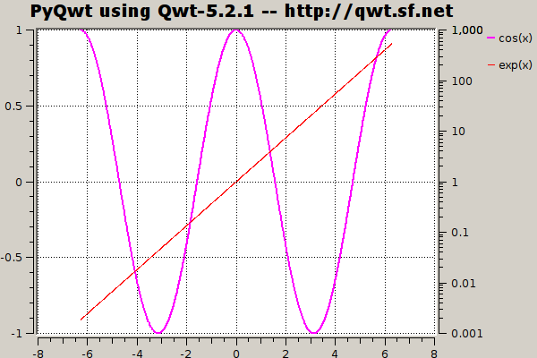
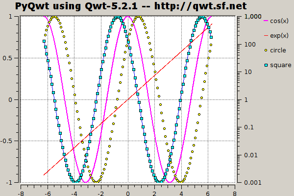

Introduction
************

PyQwt is a set of Python bindings for the
`Qwt <http://qwt.sourceforge.net>`_
library featuring fast plotting of Python lists and tuples and the
powerful multi-dimensional arrays provided by
`NumPy <http://numpy.scipy.org>`_, the fundamental package for
efficient scientific and engineering computing in Python. [#]_

NumPy
=====

The `NumPy <http://numpy.scipy.org>`_ package extends Python with 
multi-dimensional arrays and a complete set of 'standard' functions 
and operators to manipulate the arrays. NumPy turns Python into is an
ideal language experimental numerical and scientific computing (as
powerful as APL, MatLab, IDL and others, but much more elegant).

If you do not have a mathematical background, you can think of a
1-dimensional array as a column in a spreadsheet.  The spreadsheet
lets you change whole columns element by element in one single
statement. In a similar way, NumPy lets you change whole arrays
element by element in one single statement as illustrated by the
following snippet::

   >>> import numpy as np
   >>> x = np.arange(0.0, 10.0, 3.0)
   >>> y = np.sin(x)
   >>> x
   array([ 0.,  3.,  6.,  9.])
   >>> y
   array([ 0.        ,  0.14112001, -0.2794155 ,  0.41211849])
   >>> x*x
   array([  0.,   9.,  36.,  81.])  

The statement::

   >>> np.arange(0.0, 10.0, 3.0)

returns a NumPy array of 4 equidistant points from 0 to 9 inclusive::

   array([ 0., 3., 6., 9.])

The statements ``y = np.sin(x)`` and ``x*x`` show that NumPy
arrays are manipulated element by element.
All this in has been coded in C, for a manifold speedup with respect
to pure Python.

You can think of a 2-dimension array as a spreadsheet: in both cases
you you can operate on blocks, columns, rows, slices of colums, slices
of rows or individual elements. 

Want to learn more?
Look at the
`Tentative NumPy Tutorial
<http://www.scipy.org/Tentative_NumPy_Tutorial>`_
for a tutorial or at the
`Guide to NumPy
<http://www.tramy.us/numpybook.pdf>`_
for an advanced book.

Qwt
===

`Qwt <http://qwt.sourceforge.net>`_ is a C++ library based on the
`Qt GUI framework <http://trolltech.com/products/qt>`_. 
The Qwt library contains widgets useful for writing technical,
scientific, and financial programs.
It includes the following widgets:

QwtCompass
   a very fancy QDial-like widget to display and control a direction.
QwtCounter
   a QSpinBox-like widget to display and control a bounded floating
   point value. 
QwtDial
   a QDial-like widget to display and control a floating point value.
QwtKnob
   a potentiometer-like widget to display and control a bounded
   floating point value. 
QwtPlot
   a widget to plot data in two dimensions.
QwtSlider
   a QSlider-like widget to display and control a bounded floating
   point value.
QwtThermo
   a thermometer-like widget to display a floating point value. 
QwtWheel
   a wheel-like widget with its axis parallel to the computer screen
   to control a floating point value over a very large range in very
   small steps.

See the `Qwt manual <http://qwt.sourceforge.net>`_ for a complete
overview of the Qwt library. 

PyQwt with NumPy
================

PyQwt is mostly used to write graphical user interface applications.
However, the following snippet shows how to use PyQwt in combination
with NumPy from the command line interpreter.
Line by line explanations follow the snippet::

   >>> import numpy as np
   >>> from PyQt4.Qt import *
   >>> from PyQt4.Qwt5 import *
   >>> from PyQt4.Qwt5.qplt import *
   >>> application = QApplication([])
   >>> x = np.arange(-2*np.pi, 2*np.pi, 0.01)
   >>> p = Plot(
   ...  Curve(x, np.cos(x), Pen(Magenta, 2), "cos(x)"),
   ...  Curve(x, np.exp(x), Pen(Red), "exp(x)", Y2),
   ...  Axis(Y2, Log),
   ...  "PyQwt using Qwt-%s -- http://qwt.sf.net" % QWT_VERSION_STR)
   >>> QPixmap.grabWidget(p).save('cli-plot-1.png', 'PNG')
   True
   >>> x = x[0:-1:10]
   >>> p.plot(
   ...  Curve(x, np.cos(x-np.pi/4), Symbol(Circle, Yellow), "circle"),
   ...  Curve(x, np.cos(x+np.pi/4), Pen(Blue), Symbol(Square, Cyan), "square"))
   >>> QPixmap.grabWidget(p).save('cli-plot-2.png', 'PNG')
   True

The statements::

   >>> import numpy as np
   >>> from PyQt4.Qt import *
   >>> from PyQt4.Qwt5 import *
   >>> from PyQt4.Qwt5.qplt import *

import numpy, PyQt4, Qwt5 and qplt.
The statement::

   >>> application = QApplication([])

initializes and starts the Qt library so that it handles mouse
movements, mouse button presses, and keyboard key presses. [#]_
The statement::

   >>> x = np.arange(-2*np.pi, 2*np.pi, 0.01)

creates an array with elements increasing from -2*np.pi to 2*np.pi in
steps of 0.01.
The statement::

   >>> p = Plot(
   ...  Curve(x, np.cos(x), Pen(Magenta, 2), "cos(x)"),
   ...  Curve(x, np.exp(x), Pen(Red), "exp(x)", Y2),
   ...  Axis(Y2, Log),
   ...  "PyQwt using Qwt-%s -- http://qwt.sf.net" % QWT_VERSION_STR)

creates and shows a plot widget with two curves and an additional
right vertical logarithmic axis.
The statement::

   >>> QPixmap.grabWidget(p).save('cli-plot-1.png', 'PNG')
   True

takes a snapshot of the plot widget and saves it into a file:

The statement::

   >>> x = x[0:-1:10]

creates a new array from the old one by selecting every tenth element
start from the index 0.
The statement::

   >>> p.plot(
   ...  Curve(x, np.cos(x-np.pi/4), Symbol(Circle, Yellow), "circle"),
   ...  Curve(x, np.cos(x+np.pi/4), Pen(Blue), Symbol(Square, Cyan),
   ...  "square"))

plots two new curves on the widget using the new array.
The statement::

   >>> QPixmap.grabWidget(p).save('cli-plot-2.png', 'PNG')
   True

takes a snapshot of the plot widget and saves it into a file:

.. _getting-help:

Getting help
============

PyQwt and PyQwt3D have a low volume mailing list to answer questions
on installation problems and how to use the more advanced features.
In particular, many of the more advanced examples using object
oriented programming have been written to answer questions.
Most questions help to improve PyQwt!

Please,
`subscribe <http://lists.sourceforge.net/lists/listinfo/pyqwt-users>`_
to the mailing list before posting on the
`mailing list <mailto:pyqwt-users@lists.sourceforge.net>`_.

The mailing list is a subscribers only list and mail from
non-subscribers is deferred to filter spam (more than 95 % of the mail
by non-subscribers is spam and mail by non-subscribers is rejected).

The mailing list is configured to garantee anonimity as much as
possible. 

.. [#] The older numerical Python extension packages,
       `numarray
       <http://www.stsci.edu/resources/software_hardware/numarray>`_ 
       and
       `Numeric <http://numpy.scipy.org/>`_
       are deprecated.

.. [#] PyQt-4.3.x and later support displaying Qt widgets from the
       Python command line interpreter.